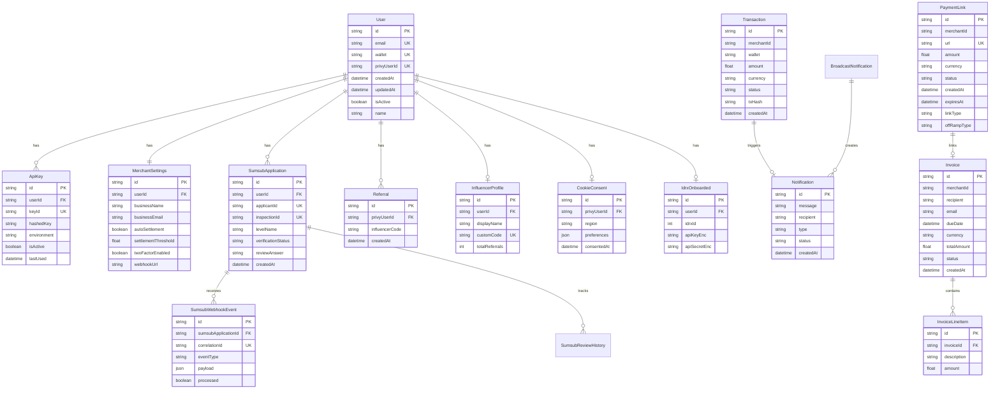

# NedaPay Merchant Portal - System Architecture Diagram

## System Architecture Overview

```mermaid
graph TB
    subgraph "Client Layer"
        A[Web Browser]
        A1[Mobile Browser]
    end

    subgraph "Frontend - Next.js 15 App Router"
        B[Landing Page]
        C[Dashboard]
        D[Payment Links]
        E[Invoice Management]
        F[Ramps/Off-Ramp]
        G[Compliance/KYC-KYB]
        H[Analytics]
        I[Settings]
    end

    subgraph "Authentication & State Management"
        J[Privy Auth Provider]
        J1[Wagmi Provider]
        J2[React Query Client]
        J3[Theme Provider]
        J4[Middleware - Route Protection]
    end

    subgraph "API Layer - Next.js API Routes"
        K[/api/user]
        L[/api/payment-links]
        M[/api/send-invoice]
        N[/api/transactions]
        O[/api/kyc]
        P[/api/kyb]
        Q[/api/idrxco]
        R[/api/paycrest]
        S[/api/notifications]
        T[/api/referral]
        U[/api/settings]
        V[/api/sumsub]
        W[/api/ens]
        X[/api/cookie-consent]
    end

    subgraph "Database Layer"
        Y[(PostgreSQL Database)]
        Z[Prisma ORM]
        Z1[Upstash Redis Cache]
        Z2[Supabase Real-time]
    end

    subgraph "Blockchain Layer"
        AA[Wagmi/Viem Client]
        AB[Ethers.js Provider]
        AC[Multi-Chain RPC Config]
        AD[Smart Contracts]
    end

    subgraph "Supported Networks"
        AE[Base Mainnet]
        AF[Arbitrum One]
        AG[Polygon]
        AH[BNB Chain]
        AI[Celo]
        AJ[Scroll]
        AK[Optimism]
    end

    subgraph "Smart Contract Ecosystem"
        AL[NedaPay Protocol Contract]
        AM[ERC-20 Token Contracts]
        AN[Aerodrome DEX]
        AO[Account Abstraction]
    end

    subgraph "External Services"
        AP[Sumsub KYC/KYB]
        AQ[IDRX Off-Ramp]
        AR[Paycrest Off-Ramp]
        AS[EmailJS/Resend/Mailtrap]
        AT[Coinbase OnchainKit]
        AU[Across Protocol Bridge]
        AV[Biconomy Gasless]
    end

    subgraph "Deployment & Infrastructure"
        AW[Vercel Platform]
        AX[GitHub Integration]
        AY[Edge Functions]
        AZ[Vercel Analytics]
    end

    A --> B
    A1 --> B
    B --> J
    J --> J1
    J --> J2
    J --> J3
    J4 --> C
    J4 --> D
    J4 --> E
    J4 --> F
    J4 --> G
    J4 --> H
    J4 --> I

    C --> K
    C --> N
    C --> S
    D --> L
    E --> M
    F --> Q
    F --> R
    G --> O
    G --> P
    G --> V
    H --> N
    I --> U
    I --> X

    K --> Z
    L --> Z
    M --> Z
    N --> Z
    O --> Z
    P --> Z
    Q --> Z
    R --> Z
    S --> Z
    T --> Z
    U --> Z
    V --> Z
    W --> AA
    X --> Z

    Z --> Y
    Z --> Z1
    Z --> Z2

    J1 --> AA
    AA --> AB
    AB --> AC
    AC --> AE
    AC --> AF
    AC --> AG
    AC --> AH
    AC --> AI
    AC --> AJ
    AC --> AK

    AE --> AD
    AF --> AD
    AG --> AD
    AH --> AD
    AI --> AD
    AJ --> AD
    AK --> AD

    AD --> AL
    AD --> AM
    AD --> AN
    AD --> AO

    O --> AP
    P --> AP
    V --> AP
    Q --> AQ
    R --> AR
    M --> AS
    AA --> AT
    AA --> AU
    AA --> AV

    AX --> AW
    B --> AW
    C --> AW
    AW --> AY
    AW --> AZ

    style A fill:#e1f5ff
    style A1 fill:#e1f5ff
    style J fill:#fff3e0
    style Y fill:#f3e5f5
    style AA fill:#e8f5e9
    style AL fill:#fff9c4
    style AP fill:#fce4ec
    style AW fill:#e0f2f1
```

## Data Flow Architecture


## Database Schema Architecture



## Multi-Chain Stablecoin Architecture


## Security & Compliance Architecture


## Payment Link Types & Features


## Payment Processing Flow


## Off-Ramp Integration Flow


## Technology Stack Layers


## API Endpoint Structure

```mermaid
graph LR
    subgraph "API Routes"
        API[/api]
    end

    subgraph "User Management"
        API --> U1[/user]
        API --> U2[/settings]
        API --> U3[/cookie-consent]
    end

    subgraph "Payment Operations"
        API --> P1[/payment-links]
        API --> P2[/send-invoice]
        API --> P3[/transactions]
    end

    subgraph "Compliance"
        API --> C1[/kyc - 11 endpoints]
        API --> C2[/kyb - 6 endpoints]
        API --> C3[/sumsub - 3 endpoints]
    end

    subgraph "Off-Ramp Providers"
        API --> O1[/idrxco - 10 endpoints]
        API --> O2[/paycrest - 3 endpoints]
    end

    subgraph "Utilities"
        API --> UT1[/ens]
        API --> UT2[/notifications - 3 endpoints]
        API --> UT3[/referral - 5 endpoints]
        API --> UT4[/admin]
    end

    style API fill:#e1f5ff
    style C1 fill:#fff3e0
    style O1 fill:#f3e5f5
```

---

## Architecture Highlights

### Core Capabilities
- **Multi-Chain Support**: 7 blockchain networks with automatic failover
- **11 Stablecoins**: Global and regional currency support
- **Dynamic Fee Structure**: 0.2% - 1.0% based on transaction size
- **Real-Time Processing**: WebSocket notifications and live updates
- **Enterprise Security**: Multi-layer authentication and encryption

### Deployment Strategy

**Vercel Deployment**
- GitHub integration with automatic deployments
- Environment branches (development, staging, production)
- Serverless function deployment
- Edge computing optimization
- CDN distribution

### Scalability Features
- **Database Optimization**: Connection pooling and Redis caching
- **Microservices Ready**: Modular API structure

### Compliance & Security
- **KYC/KYB Integration**: Sumsub-powered verification
- **Audit Trails**: Complete transaction history
- **2FA Support**: Enhanced account security
- **Smart Contract Security**: OpenZeppelin standards

### Integration Ecosystem
- **Wallet Support**: MetaMask, Coinbase, WalletConnect, Embedded Wallets
- **DEX Integration**: Aerodrome for token swapping
- **Cross-Chain Bridge**: Across Protocol integration
- **Account Abstraction**: Biconomy gasless transactions
- **Off-Ramp Partners**: IDRX (Indonesia), Paycrest (Africa)
